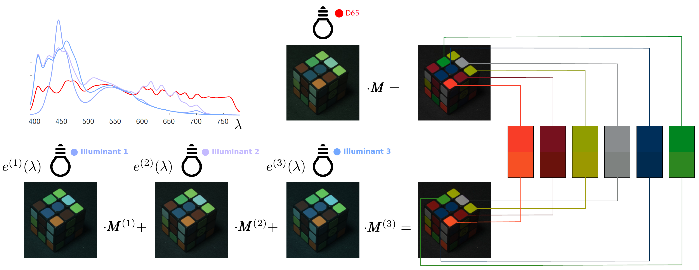

# Color-Accurate Camera Capture with Multispectral Illumination and Multiple Exposures
[[paper]](https://www.cl.cam.ac.uk/~rkm38/pdfs/gao2024color_acurate_multispectral_capture.pdf)

We explore an approach in which we can capture accurate colors with a regular camera by optimizing the spectral composition of the illuminant and capturing one or more exposures. We jointly optimize for the signal-to-noise ratio and for the color accuracy irrespective of the spectral composition of the scene. One or more images captured under controlled multispectral illuminants are then converted into a color-accurate image as seen under the standard illuminant of D65.

## Calculate optimized illuminants
`run_optimization.m` is used for calculating the optimized illuminants for our two cameras, i.e. Sony A7R3 and IDS U3-3800CP-C-HQ, for which we measured their spectral sensitivity functions (SSFs) in our lab. If you have measured the SSFs of your own camera, you can also get the optimized illuminants for it. The required parameter is the number of exposures `k` where we normally set to 1, 2 or 3.  

## Test real images captured under our optimized illuminants
`run_testing.m` is used for testing the images captured under our optimized illuminants. We captured the RAW camera values of the color checker under our D65 and optimized illuminants under 1, 2 and 3 exposures. We can obtain the quantitative results based on the provided data.